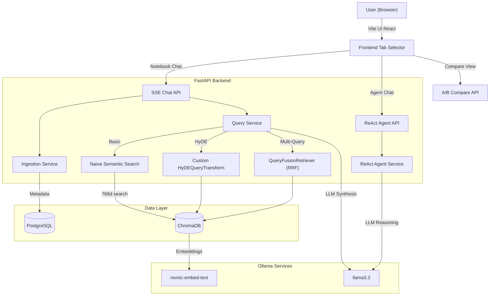

# 🧠 RAG-QA-SYSTEM-LLAMAINDEX

A premium, production-ready retrieval-augmented generation (RAG) QA notebook and ReAct agent system built with **FastAPI**, **React (Vite + TS)**, and **LlamaIndex**.

This repository implements high-precision RAG by solving the classic pitfalls of naive semantic search (lost-in-the-middle context, buried definitions, missing query prefixes, and rate limit exhaustion) through **local execution, prefix-aware nomic-embed-text modeling, and Multi-Query fusion**.

---

## 🏗️ Architecture



---

## ✨ Features & Enhancements

* **100% Free & Offline (Ollama)**: Configured out-of-the-box to run locally with `llama3.2` and `nomic-embed-text` to avoid high API costs and daily token rate limits.
* **Precision Retrieval Settings**: Standardized chunking (`chunk_size=512`, `chunk_overlap=64`) to prevent specific concepts and acronym definitions from getting lost in large paragraphs.
* **Prefix-Aware Embedding**: Built-in automatic detection that injects `search_query: ` and `search_document: ` prefixes for `nomic-embed-text` so similarity ranks match exactly.
* **Multi-Query Fusion (Phase 4)**: Decomposes a user query into 3 distinct search vectors in parallel, merges results, and ranks them using **Reciprocal Rank Fusion (RRF)**.
* **Custom HyDE Transform**: Custom implementation of LlamaIndex's `HyDEQueryTransform` resolving cross-version abstract method instantiations.
* **Side-by-Side Comparison**: Side-by-side A/B comparison endpoint (`POST /api/notebooks/{id}/compare`) to compare retrieval results between modes in real-time.
* **ReAct Agent**: Smart agent capable of executing RAG tools, Tavily web search, and calculator tasks inside Docker-grade execution runtimes.

---

## 🚀 Quick Start

### Prerequisites
1. **Ollama**: Install and download the models:
   ```bash
   ollama pull llama3.2
   ollama pull nomic-embed-text
   ```
2. **Docker**: For running databases.
3. **Python 3.10+** and **Node.js 18+**.

### Setup Databases
Spin up PostgreSQL and ChromaDB containers:
```bash
docker compose up -d
```

### Backend Setup
1. Navigate to backend:
   ```bash
   cd backend
   ```
2. Create virtual environment and install dependencies:
   ```bash
   python -m venv .venv
   .venv\Scripts\activate
   pip install -r requirements.txt
   ```
3. Copy and configure environment:
   ```bash
   cp .env.example .env
   # Ensure LLM_PROVIDER=ollama is set
   ```
4. Start FastAPI server:
   ```bash
   uvicorn app.main:app --reload --port 8000
   ```

### Frontend Setup
1. Navigate to frontend:
   ```bash
   cd frontend
   ```
2. Install dependencies and start Vite:
   ```bash
   pnpm install  # or npm install
   pnpm dev      # or npm run dev
   ```

---

## 🧪 Testing & Coverage

The backend is fully verified with a high-coverage unit and integration test suite:
* **73 tests passing successfully**
* **83% total code coverage**

To run tests and view the coverage report:
```bash
cd backend
.venv\Scripts\pytest --cov=app
```
